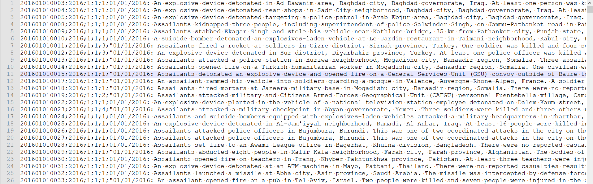
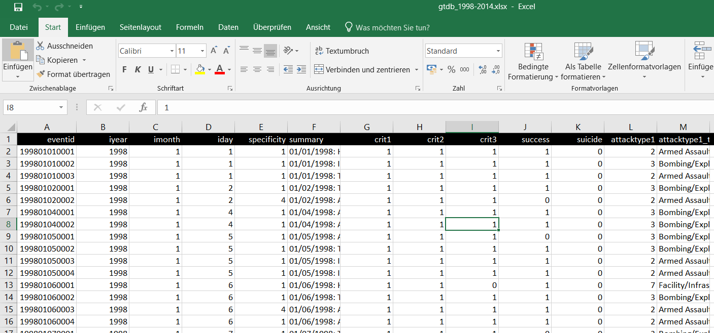
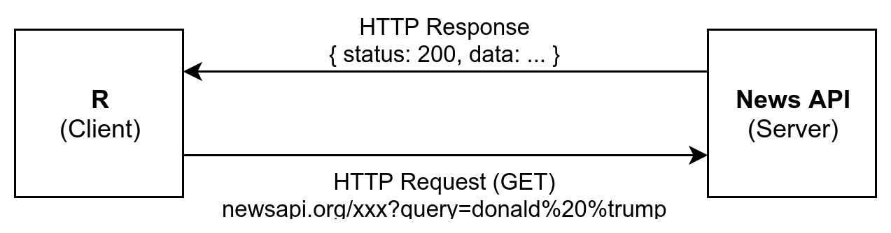
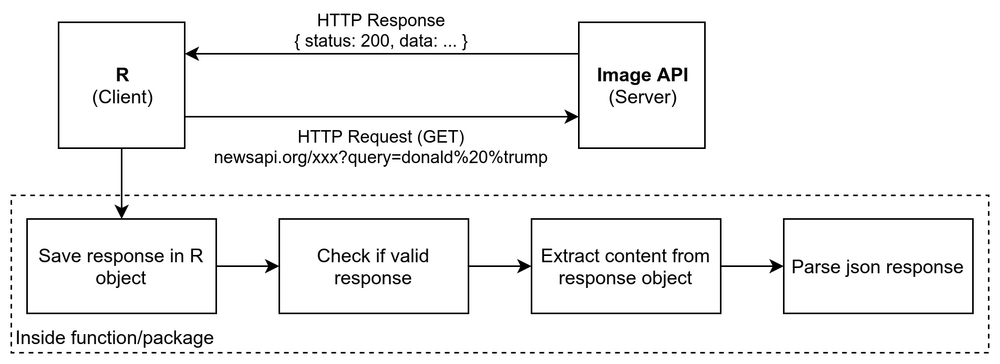

# Agenda
## Tag 1 - 14. Juni {.smaller}
10:00 Arbeitsumgebung einrichten und Packages installieren

11:30 `r emo::ji("coffee")` `r emo::ji("coffee")` `r emo::ji("coffee")`

12:00 Kurze Wiederholung von R Basics 

13:00 _Aufgabenblog 1_

13:30 `r emo::ji("pizza")` `r emo::ji("pizza")` `r emo::ji("pizza")`

14:30 Daten einlesen & speichern

15:00 _Aufgabenblog 2_

15:45 `r emo::ji("coffee")` `r emo::ji("coffee")` `r emo::ji("coffee")`

16:00 APIs

16:30 _Aufgabenblog 3_

## Tag 2 - 15. Juni {.smaller}

10:00 Web Scraping

10:45 _Aufgabenblog 4_

11:30 `r emo::ji("coffee")` `r emo::ji("coffee")` `r emo::ji("coffee")`

12:00 Daten zusammenführen

12:30 _Aufgabenblog 5_

13:00  `r emo::ji("pizza")` `r emo::ji("pizza")` `r emo::ji("pizza")`

14:00 Mini Package 

14:45 _Aufgabenblog 6_


# Arbeitsumgebung einrichten

## R versus RStudio

- R ist eine Programmiersprache, wie z.B. Python, Java oder C++
- RStudio ist Integrated Development Environment (IDE)
- RStudio hilft uns besseren R Code zu schreiben
- RStudio stellt viele Tools bereit z.B. automatisch Daten einlesen oder 
R Projekte
- R funktioniert auch ohne RStudio, aber RStudio **nicht** ohne R

## R Projekte  {.smaller}

- der Start von jedem neuen Projekt
- automatisches Arbeitverzeichnis (`setwd()`)
- alle Pfade sind relativ

```
./
  |- 01-read.R
  |- 02-collection.R
  |- 03-cleaning.R
  |- 04-analysis.R
  |- 05-plot.R
  |- data/
     |- soep.csv
     |- mdbs.rds
     |- step-1.rds
  |- helper/
     |- download-mdbs.R
  |- plots/
     |- histogramm-age.pdf
     |- mdbs-party.pdf
```

## Packages installieren

```{r, eval=FALSE}
packages <- c("tidyverse", "newsanchor", "htmltab", "readxl")
install.packages(packages)
```

- **tidyverse**: "The tidyverse is an opinionated collection of R packages designed for data science. All packages share an underlying design philosophy, grammar, and data structures." (tidyverse Website, 2019)

- **newsanchor**: "newsanchor provides a wrapper for https://newsapi.org/. News API is a simple HTTP REST API for searching and retrieving live articles from all over the web. You can get breaking news headlines, and search for articles from over 30,000 news sources and blogs." (newsanchor Docs, 2019)

- **htmltab**: "HTML tables are a valuable data source but extracting and recasting these data into a useful format can be tedious. This package allows to collect structured information from HTML tables." (htmltab docs, 2019)

# `r emo::ji("coffee")` `r emo::ji("coffee")` `r emo::ji("coffee")`

# R Basics

## Primitive Datentypen

```{r, eval=FALSE}
# character
name <- "Jane"

# numeric
pi <- 2.1415

# integer
x <- 5L
```

## Komplexe Datentypen

```{r, eval=FALSE}
# vector
vector <- c(2, 3, 4, 5, 6)

# list
person <- list(name = "Jane",
               age = 24)

# data frame
persons <- data.frame(name = c("Jane", "Joe"),
                      age = c(24, 22),
                      stringsAsFactors = FALSE)
```

## Subsetting

## Kontrollstrukturen 1 {.smaller}

```{r}
age <- 21
if (age >= 18) {
  print(emo::ji("beer"))
} else {
  print(emo::ji("no_entry"))
}
```

```{r}
age <- 15
if (age >= 18) {
  print(emo::ji("beer"))
} else {
  print(emo::ji("no_entry"))
}
```

## Kontrollstrukturen 2

```{r, results="hold"}
ages <- c(18, 17, 21, 22, 16, 15, 19)
test <- ifelse(ages >= 18, emo::ji("beer"), emo::ji("no_entry"))
ages
test
```

## For-Schleife

```{r}
numbers <- c(1, 2, 3, 4, 5)
for (number in numbers) {
  print(number^2)
}
```

## Aufgaben #1

1. Erstelle einen Vektor k mit den Werten `1`, `32`, `76`, `12` und `45`.
2. Schreibe eine For-Schleife, die die Quadratwurzeln 
(`sqrt()`) des Vektors `k` ausgibt.

# `r emo::ji("pizza")` `r emo::ji("pizza")` `r emo::ji("pizza")`

# Daten einlesen & speichern

## CSV (1)

```{r, out.width="80%", echo=FALSE}

```

- jede Zeile in der Datei entspricht einer Zeile im Datensatz
- Spalten werden mit Hilfe eines sogenannten Seperators/Delimiter 
getrennt (z.B.: Komma, Semicolon)
- **Vorteil**: kann von fast allen Prgrammen gelesen werden
- **Nachteil**: relativ langsam bei großen Datensätzen

## CSV (2)

```{r, eval=FALSE}
library(readr) # wird automatisch im tidyverse geladen

# csv innerhalb eines projekts einlesen
mdbs <- read_csv("./data/mdbs.csv")

# csv schreiben
```


## Excel (1)

```{r, out.width="70%", echo=FALSE}

```

- **Vorteil**: Daten können von Hand erstellt werden
- **Nachteil**: Daten und Metadaten werden nicht sauber getrennt; propritäres Format

## Excel (2)

```{r, eval=FALSE}
library(readxl) # wird automatisch im tidyverse geladen

# xls/xlsx innerhalb eines projekts einlesen
social_media <- read_xlsx("./data/social_media.xlsx")

# excel datei schreiben
```


## RDS (1)

- speichern und laden von R Objekten, wie sie im Arbeitspeicher liegen
- **Vorteil**: sehr schnell schreiben und laden; exaktes Abbild
- **Nachteil**: kann nur in R geöffnet werden

## RDS (2)

```{r, eval=FALSE}
library(readr) # wird automatisch im tidyverse geladen

# rds innerhalb eines projekts einlesen
gender <- read_rds("./data/gender.rds")

# rds innerhalb eines projekts schreiben
write_rds(gender, "./data/gender2.rds")

# rds mit kompression (hilfreich wenn man daten per mail senden will)
write_rds(gender, "./data/gender_compressed.rds", compress = "gz")
```


## Aufgaben #2

1. Lese den Datensatz `senators.csv` ein und speicher den Datensatz in der 
Variable `senators`.
2. Lese den Datensatz `social_media.xls` ein und speicher den Datensatz in
der Variable `social_media`.
3. Lese den Datensatz `political.rds` ein und speicher den Datensatz in
der Variable `political`.

_Alle Datensätze liegen im Ordner `data`. Die Daten stammen aus dem 
[legislatoR](https://github.com/saschagobel/legislatoR) Package von Sascha 
Goebel und Simon Munzert._

# `r emo::ji("coffee")` `r emo::ji("coffee")` `r emo::ji("coffee")`

# APIs

## APIs (1)

## APIs (2)

```{r, out.width="100%", echo=FALSE}

```

## News API & newsanchor package

- [newsapi.org](newsapi.org)

```{r, eval=FALSE}
# package laden
library(newsanchor)

# api token speichern

# daten zum suchbegriff donald trump herunterlanden
```


## Aufgaben 3

1. Suche nach den US-amerikanischen Zeitungen, die mit der News 
API verfügbar sind.
2. Wähle die drei größten Tageszeitungen aus und suche die entsprechenden
Synonyme im newsanchor package raus.
3. Wähle eine:n Politiker:in aus dem `senator` Datensatz und suche alle
verfügbaren Artikeln innerhalb der gewählten Tageszeitungen raus.

# Web Scraping

## Web Scraping (1)

## htmltab

```{r, eval=FALSE}
# package laden
library(htmltab)

# URL definieren
url <- "https://en.wikipedia.org/wiki/List_of_countries_by_GDP_%28PPP%29_per_capita"

# tabelle herunterladen
gdp_per_country <- htmltab(url, which = 3)
```

## rvest

```{r, eval=FALSE}
# package laden
library(rvest)

```

## Aufgabe 4

1. Lade x herunter

# `r emo::ji("coffee")` `r emo::ji("coffee")` `r emo::ji("coffee")`

# Daten zusammenführen

## Daten zusammenführen

## dplyr

```{r, eval=FALSE}
library(dplyr) # wird automatisch im tidyverse geladen

# rbind

# cbind

# daten joinen
left_join()
right_join()
```


## Aufgabe 5

1. Füge x und y zusammen.

# `r emo::ji("pizza")` `r emo::ji("pizza")` `r emo::ji("pizza")`

# Mini Package

## Steps

```{r, out.width="100%", echo=FALSE}

```

## Code

```{r, eval=FALSE}
# packages laden
library(httr)
library(jsonlite)

# url definieren
url <- ""

# "get" anfrage senden
response <- httr::GET(url)

# check anfrage
httr::http_error(response)

# parse content
content <- httr::content(response, type = "text")
parsed_content <- jsonlite::fromJSON(content)
```


## How to write a function?

```{r, eval=FALSE}
multiply <- function (x, y) {
  z <- x * y
  return(z)
} 
```


## Aufgabe 6


