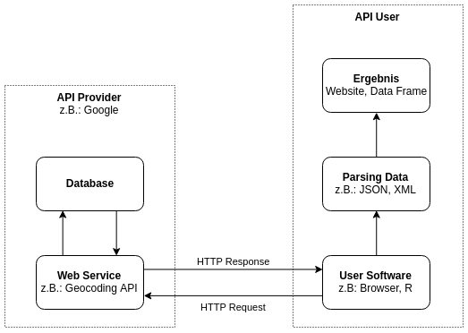
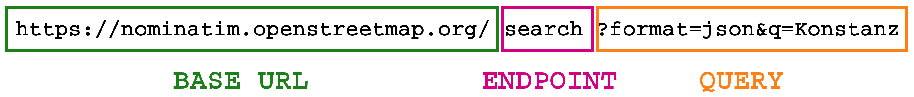
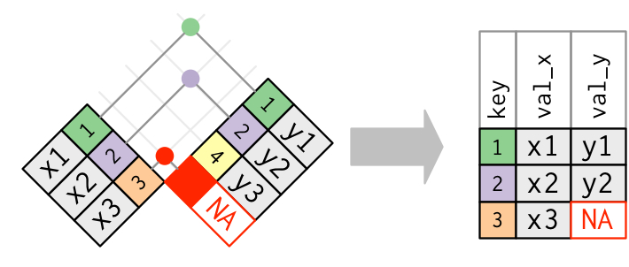

# Agenda
## Tag 1 - 14. Juni {.smaller}
10:00 Arbeitsumgebung einrichten und Packages installieren

11:30 `r emo::ji("coffee")` `r emo::ji("coffee")` `r emo::ji("coffee")`

12:00 Kurze Wiederholung von R Basics 

13:00 _Aufgabenblog 1_

13:30 `r emo::ji("pizza")` `r emo::ji("pizza")` `r emo::ji("pizza")`

14:30 Daten einlesen & speichern

15:00 _Aufgabenblog 2_

15:45 `r emo::ji("coffee")` `r emo::ji("coffee")` `r emo::ji("coffee")`

16:00 APIs

16:30 _Aufgabenblog 3_

## Tag 2 - 15. Juni {.smaller}

10:00 Web Scraping

10:45 _Aufgabenblog 4_

11:30 `r emo::ji("coffee")` `r emo::ji("coffee")` `r emo::ji("coffee")`

12:00 Daten zusammenführen

12:30 _Aufgabenblog 5_

13:00  `r emo::ji("pizza")` `r emo::ji("pizza")` `r emo::ji("pizza")`

14:00 Mini Package 

14:45 _Aufgabenblog 6_


# Arbeitsumgebung einrichten

## R versus RStudio

- R ist eine Programmiersprache, wie z.B. Python, Java oder C++
- RStudio ist Integrated Development Environment (IDE)
- RStudio hilft uns besseren R Code zu schreiben
- RStudio stellt viele Tools bereit z.B. automatisch Daten einlesen oder 
R Projekte
- R funktioniert auch ohne RStudio, aber RStudio **nicht** ohne R

## R Projekte  {.smaller}

- der Start von jedem neuen Projekt
- automatisches Arbeitverzeichnis (`setwd()`)
- alle Pfade sind relativ

```
./
  |- 01-read.R
  |- 02-collection.R
  |- 03-cleaning.R
  |- 04-analysis.R
  |- 05-plot.R
  |- data/
     |- soep.csv
     |- mdbs.rds
     |- step-1.rds
  |- helper/
     |- download-mdbs.R
  |- plots/
     |- histogramm-age.pdf
     |- mdbs-party.pdf
```

## Packages installieren

```{r, eval=FALSE}
packages <- c("tidyverse", "newsanchor", "htmltab", "readxl")
install.packages(packages)
```

- **tidyverse**: "The tidyverse is an opinionated collection of R packages designed for data science. All packages share an underlying design philosophy, grammar, and data structures." (tidyverse Website, 2019)

- **newsanchor**: "newsanchor provides a wrapper for https://newsapi.org/. News API is a simple HTTP REST API for searching and retrieving live articles from all over the web." (newsanchor Docs, 2019)

- **htmltab**: "This package allows to collect structured information from HTML tables." (htmltab docs, 2019)

- **readxl**: "Import excel files into R." (readxl docs, 2019)

# `r emo::ji("coffee")` `r emo::ji("coffee")` `r emo::ji("coffee")`

# R Basics

## Primitive Datentypen

```{r, eval=FALSE}
# character
name <- "Jane"

# numeric
pi <- 2.1415

# integer
x <- 5L
```

## Komplexe Datentypen

```{r, eval=FALSE}
# vector
vector <- c(2, 3, 4, 5, 6)

# list
person <- list(name = "Jane",
               age = 24)

# data frame
persons <- data.frame(name = c("Jane", "Joe"),
                      age = c(24, 22),
                      stringsAsFactors = FALSE)
```

## Subsetting (1)

```{r}
a <-  c(1, 2, 3, 4, 5, 6, 7, 8, 9, 10)
a[1:3]
```
```{r}
b <- c(1, 2, 3, 1, 3, 5, 7, 1, 3, 1)
b[b == 1]
```
```{r}
a[b >= 3]
```


## Subsetting (2)

```{r, echo=FALSE}
s_l_f <- data.frame( Stadt = c("Konstanz", "Stuttgart", "Essen"),
                   Land = c("Kolumbien", "Schweiz", "Estland"),
                   Fluss = c("Kongo", "Seine", "Elbe"),
                   Einwohner = c(82, 32, 56),
                   stringsAsFactors = FALSE)
```
```{r}
s_l_f
```

- mit eckigen Klammern können wir uns Werte an bestimmten Stelle ausgaben lassen. Wollen wir alle Werte, so lassen wir die Dimension frei

```{r}
# df[row, column]
s_l_f[1, ]
```


## Subsetting (3)

- <i class="fa fa-exclamation-triangle "></i> Bedingung immer nur auf der Reihe, **nie** auf der Spalte

```{r}
# df[Bedingung, ]
s_l_f[s_l_f$Einwohner > 50, ]
```

```{r}
# df[Bedingung, column]
s_l_f[s_l_f$Einwohner > 60, c("Land", "Fluss")]
```


## Kontrollstrukturen 1 {.smaller}

```{r}
age <- 21
if (age >= 18) {
  print(emo::ji("beer"))
} else {
  print(emo::ji("no_entry"))
}
```

```{r}
age <- 15
if (age >= 18) {
  print(emo::ji("beer"))
} else {
  print(emo::ji("no_entry"))
}
```

## Kontrollstrukturen 2

```{r, results="hold"}
ages <- c(18, 17, 21, 22, 16, 15, 19)
test <- ifelse(ages >= 18, emo::ji("beer"), emo::ji("no_entry"))
ages
test
```

## For-Schleife

```{r}
numbers <- c(1, 2, 3, 4, 5)
for (number in numbers) {
  print(number^2)
}
```

## Aufgaben #1

1. Erstelle einen Vektor k mit den Werten `1`, `32`, `76`, `12` und `45`.
2. Schreibe eine For-Schleife, die die Quadratwurzeln 
(`sqrt()`) des Vektors `k` ausgibt.
3. Erweitere die For-Schleife aus 2. folgendermaßen: Ist die
Quadratwurzel kleiner als `5`, so gebe `hello world` aus , andernfalls
`HELLO WORLD`. 
4. Nutze nun die vektorisierte Form (`ifelse`), um den Vektor m zu erstellen:
Ist k^2 größer als 267.4, so soll m k^2 annehmen, andernfalls -3.

# `r emo::ji("pizza")` `r emo::ji("pizza")` `r emo::ji("pizza")`

# Daten einlesen & speichern

## CSV (1)

```{r, out.width="80%", echo=FALSE}
knitr::include_graphics("./assets/img/csv.png")
```

- jede Zeile in der Datei entspricht einer Zeile im Datensatz
- Spalten werden mit Hilfe eines sogenannten Seperators/Delimiter 
getrennt (z.B.: Komma, Semicolon)
- **Vorteil**: kann von fast allen Prgrammen gelesen werden
- **Nachteil**: relativ langsam bei großen Datensätzen

## CSV (2)

```{r, eval=FALSE}
library(readr) # wird automatisch im tidyverse geladen

# csv innerhalb eines projekts einlesen
mdbs <- read_csv("./data/mdbs.csv")

# csv schreiben 
write_csv(mdbs, path = "./data/mdbs_2.csv")
```


## Excel (1)

```{r, out.width="70%", echo=FALSE}
knitr::include_graphics("./assets/img/xlsx.png")
```

- **Vorteil**: Daten können von Hand erstellt werden
- **Nachteil**: Daten und Metadaten werden nicht sauber getrennt; propritäres Format

## Excel (2)

```{r, eval=FALSE}
library(readxl) # wird automatisch im tidyverse geladen

# xls/xlsx innerhalb eines projekts einlesen
social_media <- read_xlsx("./data/social_media.xlsx")
```


## RDS (1)

- speichern und laden von R Objekten, wie sie im Arbeitspeicher liegen
- **Vorteil**: sehr schnell schreiben und laden; exaktes Abbild
- **Nachteil**: kann nur in R geöffnet werden

## RDS (2)

```{r, eval=FALSE}
library(readr) # wird automatisch im tidyverse geladen

# rds innerhalb eines projekts einlesen
gender <- read_rds("./data/gender.rds")

# rds innerhalb eines projekts schreiben
write_rds(gender, "./data/gender2.rds")

# rds mit kompression (hilfreich wenn man daten per mail senden will)
write_rds(gender, "./data/gender_compressed.rds", compress = "gz")
```


## Aufgaben #2

1. Lese den Datensatz `senators.csv` ein und speicher den Datensatz in der 
Variable `senators`.
2. Lese den Datensatz `social_media.xls` ein und speicher den Datensatz in
der Variable `social_media`.
3. Lese den Datensatz `political.rds` ein und speicher den Datensatz in
der Variable `political`.

_Alle Datensätze liegen im Ordner `data`. Die Daten stammen aus dem 
[legislatoR](https://github.com/saschagobel/legislatoR) Package von Sascha 
Goebel und Simon Munzert._

# `r emo::ji("coffee")` `r emo::ji("coffee")` `r emo::ji("coffee")`

# APIs

## APIs (1)
```{r, out.width="65%",echo=FALSE,fig.align="center"}

```

## APIs (2)
```{r, out.width="100%",echo=FALSE,fig.align="center"}

```

**BASE URL** (Stammurl): Wer bietet den Service an?

**ENDPOINT** (Endpunkt): Welchen Service möchtest du nutzten?

**PARAMETER** (Query): Auf welche Daten möchtest du zugreifen? Wie sollen die 
Daten gefiltert werden? 

*Aufgabe:* Ändere den query parameter q und finde die Koordinaten für Washington 
DC im Browser.

## News API & newsanchor package

```{r, eval=FALSE}
# package laden
library(newsanchor)

# api token speichern
api_key <- "xxx"
set_api_key(api_key, path = "~/.Renviron")

# daten zum suchbegriff donald trump herunterlanden
articles <- get_everything(query = "Donald Trump")

# andere verfügbare funktionen
?get_headlines
?get_sources
?terms_sources
?terms_country
?terms_language
```


## Aufgaben 3

1. Suche nach den US-amerikanischen Zeitungen, die mit der News 
API verfügbar sind.
2. Wähle die drei größten Tageszeitungen aus und suche die entsprechenden
Synonyme im newsanchor package raus.
3. Wähle eine:n Politiker:in aus dem `senators` Datensatz und suche alle
verfügbaren Artikeln in englischer Sprache innerhalb der gewählten 
Tageszeitungen raus zwischen dem 03. Juni und dem 09. Juni. Speicher den result_df 
unter `my_favourite_senator` ab ! Wir werden ihn später brauchen ...

# Web Scraping

## Web Scraping (1)


Web Scraping means collecting information from websites by extracting them 
directly from the HTML source code


## htmltab

```{r, eval=FALSE}
# package laden
library(htmltab)

# URL definieren
url <- "https://en.wikipedia.org/wiki/List_of_countries_by_GDP_%28PPP%29_per_capita"

# tabelle herunterladen
gdp_per_country <- htmltab(url, which = 3)
```

## Selector Gadget

SelectorGadget is an open source tool that makes CSS selector generation 
and discovery on complicated sites a breeze. (Selector Gadget, 2018)

[https://selectorgadget.com/](https://selectorgadget.com/)

## rvest (1)

```{r, eval=FALSE}
# package laden
library(rvest)

# webiste herunterladen
white_house_down <- read_html("http://www.imdb.com/title/tt2334879/")

# cast parsen
summary <- html_nodes(white_house_down, ".summary_text")
summary <- html_text(summary)
```

## rvest (2)

```{r, eval=FALSE}
# package laden
library(rvest)

# webiste herunterladen
white_house_down <- read_html("http://www.imdb.com/title/tt2334879/")

# cast parsen
image <- html_nodes(white_house_down, ".poster img")
image_url <- html_attr(images, "src")
```

## Aufgabe 4

1. Lade die Tabelle über alle Senatoren des 115. Senats herunter 
[https://en.wikipedia.org/wiki/List_of_members_of_the_United_States_Senate](https://en.wikipedia.org/wiki/List_of_members_of_the_United_States_Senate)

# `r emo::ji("coffee")` `r emo::ji("coffee")` `r emo::ji("coffee")`

# Daten zusammenführen

## Daten zusammenführen

Oftmals stehen wir vor der Aufgabe, Daten aus unterschiedlichen Quellen zusammenzuführen. 
Je nach Anforderung, gibt es mehrere Methoden: 

- `rbind`
- `cbind`
- `merging / joining`

## R(ow)-bind (1)

- Verknüpft zwei Dataframes entlang ihrer Zeilen

```{r, eval= T, echo = FALSE}

df1 <- data.frame( Stadt = c("Konstanz", "Stuttgart", "Essen"),
                   Land = c("Kolumbien", "Schweiz", "Estland"),
                   Fluss =c("Kongo", "Seine", "Elbe"))

```


```{r, eval= T,}

df1 

```

```{r, eval= T, echo = FALSE}
df2 <- data.frame( Stadt = c("München", "Hamburg"),
                   Land = c("Mali", "Haiti"),
                   Fluss =c("Moldau", "Havel"))

```


```{r, eval= T,}

df2 

```


## R(ow)-bind (2)

```{r, eval= T,}

df_rbind <- rbind(df1, df2)
df_rbind

```


## C(olum)-bind (1)
- Verknüpft zwei Dataframes entlang ihrer Spalten

```{r, eval= T, echo = FALSE}

df3 <- data.frame( Name =  c("Kevin", "Sabine", "Eduard", "Mike", "Heidi"),
                   Tier= c("Kuh", "Schaf", "Esel","Möwe", "Hund"),
                   Beruf= c("Koch","Schriftstellerin", "Erzieher", "Maurer", "Headhunter"))

```

```{r, eval= T,}

df3 

```


## C(olum)-bind (2)

```{r, eval= T,}

df_cbind <-  cbind(df_rbind,df3)
df_cbind

```


## Merging (1)

- Verknüpfung von zwei Datensätzen mittels einer oder mehrerer Variablen

```{r, out.width = "100%",echo=FALSE}

```


## Merging (2)

```{r, eval= T, echo = FALSE}

df_purchase <- data.frame( Customer_ID =  c(1,1,2,3),
                   Product= c("Tablet", "Phone", "Laptop", "Clock"),
                   Price= c(249, 760, 1200,300))

```

```{r, eval= T,}

df_purchase 

```

```{r, eval= T, echo = FALSE}

df_income <- data.frame( Customer_ID =  c(2,3,1,4),
                   Income= c(3600,750,1200,1800))

```

```{r, eval= T,}

df_income 

```


## Merging (3)

```{r, eval= T, message=FALSE}

library(dplyr) # wird automatisch im tidyverse geladen

transparent_customer <- left_join(df_purchase, df_income, by = "Customer_ID")


transparent_customer

```


## Aufgabe 5

1. Lade nochmals die Datensätze `senators.csv`,`social_media.xls`, `political.rds`. 
2. Inspiziere die Variablen und überlegen, anhand welcher Variablen/Keys, man die Datensätze 
verbinden könnte. 
3. Wir möchten alle Informationen über die Senatoren (115. Senat) in einem einzigen Datensatz. 
Führe dazu zwei left_joins() durch! 


# `r emo::ji("pizza")` `r emo::ji("pizza")` `r emo::ji("pizza")`

# Mini Package

## Steps

```{r, out.width="100%", echo=FALSE}
knitr::include_graphics("./assets/img/api-process.jpg")
```

## Code

```{r, eval=FALSE}
# packages laden
library(httr)
library(jsonlite)

# url definieren
url <- ""

# "get" anfrage senden
response <- httr::GET(url)

# check anfrage
httr::http_error(response)

# parse content
content <- httr::content(response, type = "text")
parsed_content <- jsonlite::fromJSON(content)
```


## How to write a function?

```{r, eval=FALSE}
multiply <- function (x, y) {
  z <- x * y
  return(z)
} 
```


## Aufgabe 6 (1)

Wir haben wir euch eigens eine API mit dem Endpunkt auf   [https://imagenet.pbehrendt.eu/](https://imagenet.pbehrendt.eu/)
aufgesetzt. 

Die API hat einen einzigen Query-Parameter (`url`), der nach einem Link zu einem Bild verlangt!
  "Im Hintergrund" taggt ein Neuronales Netzwerk dann das entsprechende Bild und gibt euch die 5 wahrscheinlichsten Tags zurück.  

- Öffnet den Endpunkt in eurem Browser und probiert die API mit dem Link zum Bild eurer Wahl aus!
Wie schlägt sich das Model ? 

https://imagenet.pbehrendt.eu/?url=URLZUMBILDEURERWAHL


## Aufgabe 6 (2)

- Nutzt nun obigen Code, um eine Funktion zu schreiben, die das Ganze für euch aus R macht. 
Nenne die Funktion `label_image`, die als Argument den Link zum Bild erhält. 

- Klappt die Funktion ? Klasse ! Wende die Funktion doch einfach auf alle Image URLs aus deinem
`my_favourite_senator` - Datensatz an. (Tipp: is.na() , For-Loop , cbind()). Kannst du die Daten 
noch zusammenfügen ? 


